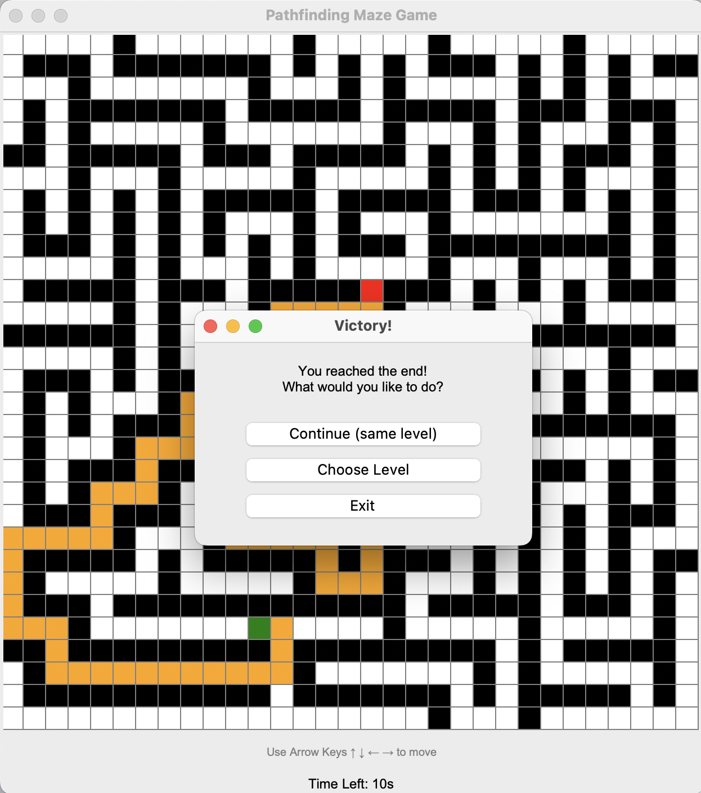

# 🧩 Maze Game 🧩

A simple interactive maze game built with Python and Tkinter. The game generates a one-solution maze and challenges the player to reach the red goal before time runs out!

  

## Features

- Automatically generated **perfect maze** using recursive backtracking
- **Arrow key movement** (↑ ↓ ← →)
- **Countdown timer**
- Real-time **path tracking**
- **Auto-solve** with BFS shown in purple if the timer runs out
- **Three difficulty levels** (Easy, Medium, Hard)

## 🛠Requirements

- Python 3.7+
- Tkinter (comes pre-installed with Python on most systems)

## Installation

```bash
git clone https://github.com/yourusername/maze-explorer.git
cd maze-explorer
python main.py
